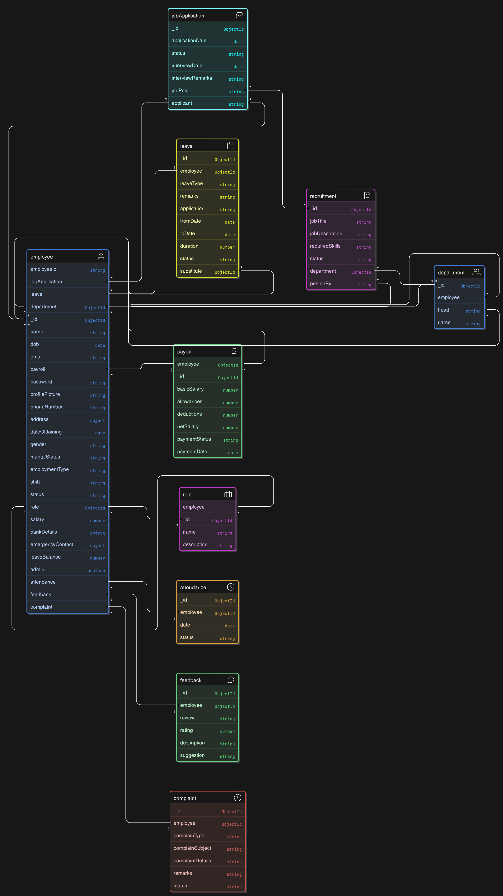

## 📂 Folder Structure

```bash
HRMS/
│── client/
│   ├── public/
│   ├── src/
│   │   ├── components/
│   │   ├── pages/
│   │   ├── context/
│   │   ├── hooks/
│   │   ├── utils/
│   │   ├── services/
│   │   ├── styles/
│   │   ├── router/
│   │   ├── redux/
│   │   ├── App.js
│   │   ├── index.js
│   ├── package.json
│   ├── .env
│
│── server/
│   ├── src/
│   │   ├── config/
│   │   ├── models/
│   │   ├── routes/
│   │   ├── controllers/
│   │   ├── middlewares/
│   │   ├── services/
│   │   ├── utils/
│   │   ├── app.js
│   ├── server.js
│   ├── package.json
│   ├── .env
│
│── README.md
│── .gitignore
│── package.json
│── yarn.lock / package-lock.json


## 📂 Schemas Relationsship

## 📂 Schemas Relationship

- **👥 Employee**  
  - `employeeId`
  - `name`
  - `dob`
  - `email`
  - `phoneNumber`
  - `address`
  - `department` (🔗 Reference to Department)
  - `role` (🔗 Reference to Role)
  - `status`
  - `salary`
  
- **🏢 Department**  
  - `departmentId`
  - `departmentName`
  
- **🎭 Role**  
  - `roleId`
  - `roleName`
  
- **📅 Attendance**  
  - `employeeId` (🔗 Reference to Employee)
  - `checkIn`
  - `checkOut`
  - `date`
  
- **🗓 Leave**  
  - `employeeId` (🔗 Reference to Employee)
  - `leaveType`
  - `leaveStartDate`
  - `leaveEndDate`
  - `status`
  
- **📜 Payroll**  
  - `employeeId` (🔗 Reference to Employee)
  - `salary`
  - `payDate`
  
- **🗣 Feedback**  
  - `employeeId` (🔗 Reference to Employee)
  - `feedbackText`
  - `rating`
  
- **📢 Complaint**  
  - `employeeId` (🔗 Reference to Employee)
  - `complaintText`
  - `status`


#  <!--  -->
